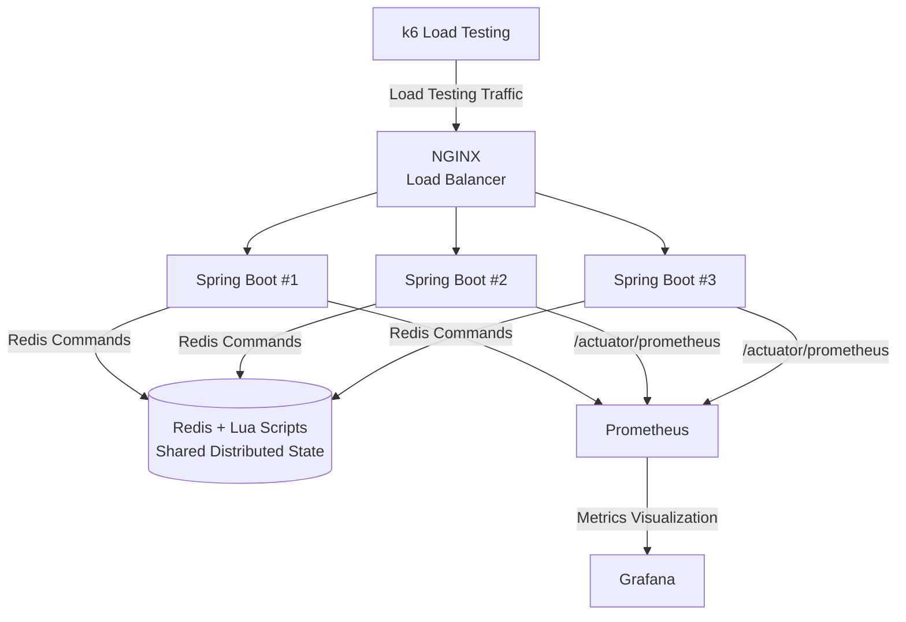
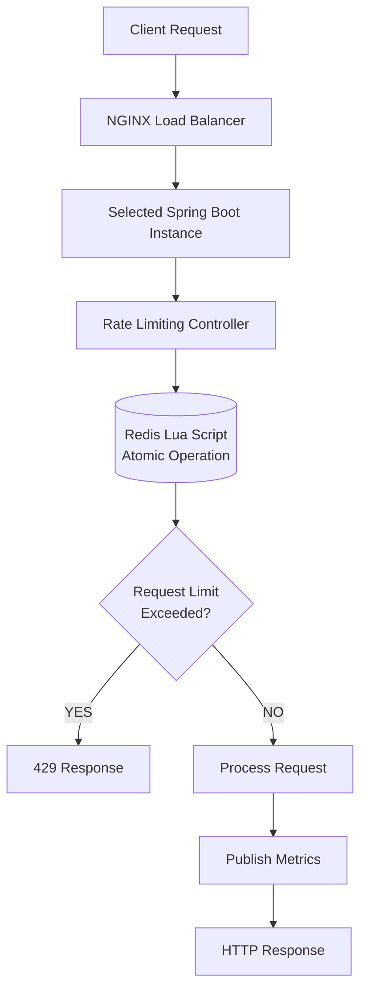
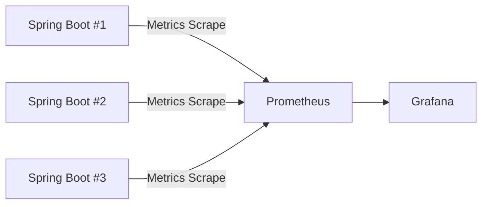

# Distributed API Rate Limiter
Modern API gateways and distributed backend systems rely heavily on scalable and concurrency-safe rate limiting mechanisms to protect infrastructure from abuse, traffic spikes, and resource exhaustion.

This project explores how production-grade distributed rate limiters are designed using centralized coordination, atomic operations, observability pipelines, benchmarking infrastructure, and distributed systems engineering principles.

Production-grade distributed API rate limiting system built using Java, Spring Boot, Redis, Lua scripting, Docker Compose, NGINX, Prometheus, Grafana, and k6.

The project focuses on distributed systems concepts such as shared state coordination, atomic operations, concurrency handling, observability, benchmarking, and scalable backend infrastructure design.

---

# Overview

This project simulates a real-world distributed rate limiting infrastructure used in modern backend systems and API gateways.

The system runs multiple Spring Boot instances behind an NGINX load balancer while sharing centralized rate limit state through Redis. Redis Lua scripts are used to guarantee atomic operations and prevent race conditions under concurrent traffic.

The project also includes:
- multiple rate limiting algorithms
- observability stack
- load testing infrastructure
- comparative benchmark analysis
- graceful degradation during Redis failures
- Dockerized infrastructure deployment

---
# Highlights

- Built distributed rate limiter using Redis + Lua scripting
- Implemented Fixed Window, Sliding Window, and Token Bucket algorithms
- Designed multi-instance distributed architecture behind NGINX
- Added Prometheus + Grafana observability stack
- Implemented algorithm-tagged metrics and distributed monitoring
- Performed distributed load testing using k6
- Added graceful degradation during Redis failures
- Benchmarked rate limiting algorithms under concurrent traffic
---
# Key Features

- Distributed architecture with multiple backend instances
- NGINX load balancing
- Shared Redis coordination
- Redis Lua scripting for atomic operations
- Fixed Window rate limiting
- Sliding Window rate limiting
- Token Bucket rate limiting
- Concurrent request handling
- Prometheus metrics collection
- Grafana dashboards
- JVM/CPU/latency monitoring
- k6 load testing
- Algorithm performance benchmarking
- Graceful degradation during Redis failures
- Docker Compose infrastructure setup

---

# Tech Stack

| Category | Technologies |
|---|---|
| Backend | Java, Spring Boot |
| Distributed Coordination | Redis |
| Atomic Operations | Lua Scripting |
| Load Balancer | NGINX |
| Monitoring | Prometheus, Grafana |
| Load Testing | k6 |
| Containerization | Docker Compose |

---
# Running The Project

## Clone Repository

```bash
git clone https://github.com/RehanKhatkar/distributed-rate-limiter.git
cd distributed-rate-limiter/infrastructure
docker compose up --build
```
## Access Services
| Service     | URL                                            |
| ----------- | ---------------------------------------------- |
| API Gateway | [http://localhost](http://localhost)           |
| Grafana     | [http://localhost:3000](http://localhost:3000) |
| Prometheus  | [http://localhost:9090](http://localhost:9090) |

Grafana Login:
- Username: admin
- Password: admin
  
## Example API Request

```bash
curl -H "X-Client-Id: user-1" \
http://localhost/rate-limit/fixed_window
```
---
# High-Level System Architecture


---
# Distributed Request Flow



## Request Lifecycle

1. Client requests first reach the NGINX load balancer.
2. NGINX distributes traffic across available Spring Boot instances.
3. The selected application instance evaluates the request against configured rate limiting rules.
4. Redis Lua scripts execute atomic rate limit operations.
5. The system determines whether the request should be allowed or rejected.
6. Metrics are published to Prometheus.
7. Grafana visualizes request statistics, latency, JVM metrics, and blocked traffic.

---
# Sample API Responses

## Allowed Request (HTTP 200)

```json
{
  "status": "success",
  "message": "Request Allowed",
  "algorithm": "fixed_window"
}
```
## Blocked Request (HTTP 429)

```json
{
  "status": "blocked",
  "message": "Rate Limit Exceeded",
  "algorithm": "fixed_window"
}
```
---
# Rate Limiting Algorithms

## 1. Fixed Window

The Fixed Window algorithm tracks requests within a fixed time interval.

### Characteristics
- Simple implementation
- Low memory usage
- High throughput
- Burst traffic at window boundaries possible

### Redis Usage
- Counter-based tracking
- Expiration using Redis TTL

---

## 2. Sliding Window

The Sliding Window algorithm tracks requests using rolling timestamps to smooth traffic spikes.

### Characteristics
- More accurate traffic shaping
- Prevents boundary burst issues
- Higher Redis memory usage

### Redis Usage
- Timestamp storage
- Sliding cleanup logic using Lua scripts

---

## 3. Token Bucket

The Token Bucket algorithm allows burst traffic while maintaining long-term request limits.

### Characteristics
- Excellent burst handling
- Low latency
- Flexible traffic shaping

### Redis Usage
- Token refill calculations
- Atomic token consumption using Lua

---

# Redis + Lua Scripting

Redis Lua scripts are used to guarantee atomic distributed operations.

## Why Lua Scripting?

Without Lua scripting, concurrent requests across multiple application instances can introduce race conditions during rate limit updates.

Lua scripts ensure:
- atomic counter updates
- concurrency-safe operations
- token bucket consistency
- sliding window cleanup
- distributed coordination safety

## Benefits

- Single-threaded Redis execution
- Race-condition-free updates
- Reduced network round trips
- Consistent distributed state management

---

# Distributed Architecture

The project uses a distributed backend architecture where multiple application instances coordinate through shared Redis state.

## Components

- NGINX for request distribution
- Multiple Spring Boot instances
- Shared Redis datastore
- Centralized observability stack

## Distributed Coordination

All backend instances:
- share the same rate limit state
- use Redis Lua scripts for atomicity
- remain stateless at application level

This architecture improves:
- scalability
- fault tolerance
- horizontal expansion capability

---

# Concurrency Handling

The project focuses heavily on concurrent request processing and distributed consistency.

## Implemented Concepts

- concurrent request handling
- multithreaded request processing
- race-condition prevention
- atomic distributed operations
- load testing under parallel traffic

## Why It Matters

Rate limiting systems operate under extremely concurrent traffic patterns. Incorrect synchronization can allow requests to bypass limits.

Redis Lua scripting guarantees consistency across concurrent distributed requests.

---

# Observability Stack



The project includes a complete observability pipeline.

## Prometheus Metrics

Collected metrics include:
- total requests
- blocked requests
- algorithm-specific metrics
- request latency
- JVM memory usage
- CPU usage
- throughput metrics

## Grafana Dashboards

Grafana dashboards visualize:
- request rate
- blocked traffic
- algorithm performance
- latency distribution
- JVM metrics
- infrastructure health

---

# Grafana Dashboards


---

# Load Testing & Benchmarking

k6 is used for stress testing and comparative algorithm benchmarking.

## Benchmark Goals

- evaluate throughput
- measure latency
- compare algorithm behavior
- validate distributed coordination
- test concurrency handling

## Tested Scenarios

- sustained traffic
- burst traffic
- concurrent requests
- high throughput scenarios
- algorithm comparison benchmarks

---
# Running Load Tests

## Fixed Window Benchmark

```bash
docker run --rm \
  --network infrastructure_default \
  -v $(pwd)/k6:/scripts \
  -e ALGORITHM=fixed_window \
  grafana/k6 \
  run /scripts/load-test.js
```
## Sliding Window Benchmark

```bash
docker run --rm \
  --network infrastructure_default \
  -v $(pwd)/k6:/scripts \
  -e ALGORITHM=sliding_window \
  grafana/k6 \
  run /scripts/load-test.js
```
## Token Bucket Benchmark
```bash
docker run --rm \
  --network infrastructure_default \
  -v $(pwd)/k6:/scripts \
  -e ALGORITHM=token_bucket \
  grafana/k6 \
  run /scripts/load-test.js
```

---
# Benchmark Results


---

# Comparative Benchmark Analysis

| Algorithm | Throughput | Latency | Burst Handling | Memory Usage |
|---|---|---|---|---|
| Fixed Window | High | Low | Weak | Low |
| Sliding Window | Medium | Medium | Strong | Medium |
| Token Bucket | High | Low | Excellent | Medium |

## Observations

### Fixed Window
Provided the highest throughput with minimal memory usage but allowed burst traffic near window boundaries.

### Sliding Window
Delivered smoother traffic shaping and more accurate limiting behavior at the cost of additional Redis memory usage.

### Token Bucket
Achieved the best balance between low latency and burst traffic handling while maintaining stable distributed coordination.

---

# Fault Tolerance & Resilience

The project includes graceful degradation handling during Redis failures.

## Failure Handling Features

- Redis timeout handling
- fail-open graceful degradation strategy
- resilient distributed coordination

## Why It Matters

Distributed systems must handle infrastructure instability without crashing application instances or causing inconsistent request behavior.

---
# Project Structure

```text
distributed-rate-limiter/
│
├── rate-limiter-service/
│   ├── src/
│   ├── Dockerfile
│   ├── pom.xml
│   └── README.md
│
├── infrastructure/
│   ├── nginx/
│   ├── grafana/
│   ├── monitoring/
│   ├── k6/
│   └── docker-compose.yml
│
├── benchmarks/
│   ├── benchmark-results.md
│   ├── fixed-window.png
│   ├── sliding-window.png
│   └── token-bucket.png
│
└── README.md
```
---
# Future Improvements

- Redis replication / Sentinel support
- Kubernetes deployment
- Dynamic tier-based rate limits
- Circuit breaker integration
- Distributed tracing
- Autoscaling support
- API gateway integration
---
This project demonstrates how production-grade distributed rate limiters are built using distributed coordination, atomic operations, observability, concurrency control, benchmarking, and fault-tolerant infrastructure design.
